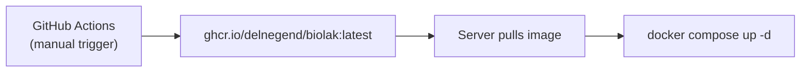

# Deployment

## Overview

BioLAK runs as a Docker container using Next.js **standalone** output mode. The deployment flow:



The Docker image includes the compiled Next.js app, Payload REST/GraphQL APIs, and the admin panel — everything needed to serve the site. The SQLite database and uploaded media persist on the host via mounted volumes.

Two Docker Compose files are provided:

| File                          | Purpose                         | Build behavior                       |
| ----------------------------- | ------------------------------- | ------------------------------------ |
| `docker-compose.staging.yaml` | Local testing before production | Builds locally from source           |
| `docker-compose.example.yaml` | Production                      | Pulls pre-built image from `ghcr.io` |

---

## Prerequisites

- A Linux server (Debian 13+ or Ubuntu 24.04+ recommended).
- [Docker Engine](https://docs.docker.com/engine/install) (with the `compose` plugin) or [Podman](https://podman.io/docs/installation).
- `just` (task runner) and `zstd` (compression tool).
- [GitHub Container Registry](https://ghcr.io) access (for pulling pre-built images).

Install the required packages on Debian/Ubuntu:

```bash
sudo apt update && sudo apt install -y curl ca-certificates zstd podman just
```

---

## Service Directory Structure

All application files live under `~/biolak`:

```text
~/biolak/
├── docker-compose.yaml      # Service orchestration (contains environment vars)
├── .justfile               # Production task runner (alias: just)
└── data/                   # Persistent data
    ├── media/              # Uploaded media files
    └── data.prod.sqlite3        # SQLite database
```

### Initial Setup

```bash
mkdir -p ~/biolak/data/media
cd ~/biolak
```

---

## Configuration

### 1. Download Templates

```bash
curl -fsSL -o ~/biolak/docker-compose.yaml https://github.com/Delnegend/biolak/raw/refs/heads/main/docker-compose.example.yaml
curl -fsSL -o ~/biolak/.justfile https://github.com/Delnegend/biolak/raw/refs/heads/main/.prod.justfile
```

### 2. Secure File Permissions

```bash
chmod 600 ~/biolak/docker-compose.yaml ~/biolak/.justfile
```

### 3. Generate Secrets

Use `openssl rand -base64 32` to generate unique values for:

- `PAYLOAD_SECRET`
- `CRON_SECRET`
- `PREVIEW_SECRET`

### 4. Edit docker-compose.yaml

| Variable                 | Value                              | Notes                                   |
| ------------------------ | ---------------------------------- | --------------------------------------- |
| `DATABASE_URI`           | `file:/app/data/data.prod.sqlite3` | Points to the persistent volume         |
| `NEXT_PUBLIC_SERVER_URL` | `https://yourdomain.com`           | Affects SEO tags, sitemap, preview URLs |
| `PAYLOAD_SECRET`         | _(generated)_                      | Encryption secret                       |
| `CRON_SECRET`            | _(generated)_                      | Bearer token for job endpoints          |
| `PREVIEW_SECRET`         | _(generated)_                      | Shared secret for draft preview         |
| `SMTP_*`                 | _(your SMTP)_                      | Optional: from, host, port, user, pass  |
| `TUNNEL_TOKEN`           | _(Cloudflare)_                     | Only needed if using `cloudflared`      |

Production defaults are in the `environment` section of `docker-compose.yaml`. Paste the generated secrets there.

---

## Production (`docker-compose.yaml`)

```bash
docker compose up -d
```

Pulls the pre-built image from `ghcr.io`. The compose file includes a `cloudflared` sidecar for secure public access.

- Database at `./data/data.prod.sqlite3`
- Port not exposed to host (traffic flows through Cloudflare Tunnel or your reverse proxy)
- SSL/termination handled by the reverse proxy.

---

## CI/CD Pipeline

### CI (`ci.yml`)

Triggers on every push/PR to `main`. Runs:

1. `just check` — lint, format, type-check
2. `just build` — production build against ephemeral SQLite DB

This ensures the app builds cleanly before any image is published.

### Publish Image (`publish-image.yaml`)

Manually triggered from GitHub Actions:

1. Go to **Actions** → **Publish Docker Image** → **Run workflow**.
2. The workflow builds the image and pushes two tags to `ghcr.io/delnegend/biolak`:
    - `:latest` — always the most recent build
    - `:{commit-sha}` — pinned to the exact commit

Images are compressed with `zstd` level 9 for space-efficient storage.

---

## Deployment

### Start the Stack

```bash
cd ~/biolak
docker compose pull     # ensure latest image
docker compose up -d    # start services
```

### Verify

```bash
docker compose ps
curl -f http://localhost:3000/api/status
```

The `/api/status` endpoint responds `200 OK` when the server is healthy.

### Monitor Logs

```bash
docker compose logs -f biolak
```

---

## Reverse Proxy & SSL/TLS

The application does **not** handle SSL/TLS natively. You must terminate TLS at a reverse proxy.

### Recommended: Cloudflare Tunnel

The production compose file includes a `cloudflared` sidecar. It creates a secure outbound tunnel so no inbound firewall rules are needed.

The tunnel is **remotely-managed** — you create it in the Cloudflare dashboard and the server just runs with the token.

1. Go to the [Cloudflare dashboard](https://dash.cloudflare.com/) → **Networking** → **Tunnels** → **Create a tunnel**.
2. Name it (e.g. `biolak`), then copy the token from the install command shown.
3. Paste the token as `TUNNEL_TOKEN` in `docker-compose.yaml`.
4. Still in the dashboard, select the tunnel → **Routes** tab → **Add route** → **Published application**.
5. Set the subdomain/domain and in **Service URL** enter `http://biolak:3000`. Save.

The `cloudflared` container in the stack will start with the tunnel token and connect automatically.

**Links:** [Create a tunnel (dashboard)](https://developers.cloudflare.com/cloudflare-one/networks/connectors/cloudflare-tunnel/get-started/create-remote-tunnel/) · [Publish an application](https://developers.cloudflare.com/cloudflare-one/networks/connectors/cloudflare-tunnel/get-started/create-remote-tunnel/#2a-publish-an-application) · [Troubleshooting tunnels](https://developers.cloudflare.com/cloudflare-one/networks/connectors/cloudflare-tunnel/troubleshoot-tunnels/common-errors/)

### Custom Reverse Proxy (Nginx, Caddy, etc.)

1. Comment out or remove the `cloudflared` service in `docker-compose.yaml`.
2. **Un-comment the `ports` section** to expose port `3000` to the host.
3. Configure your proxy to terminate SSL (e.g., Let's Encrypt) and forward to:
    - Docker network: `http://biolak:3000`
    - Host network: `http://localhost:3000`

---

## Maintenance

Production maintenance commands are run via `just` inside `~/biolak`. These target actual production data — **do not run them outside `~/biolak`.**

### Backup

```bash
cd ~/biolak
just backup
```

Stops services, saves the Docker image, compresses the entire `~/biolak` directory (excluding prior backups), restarts services, then cleans up.

Output: `~/biolak-YYYY-MM-DD_HH-MM-SS.tar.zst`

### Restore

```bash
cd ~/biolak
just restore
```

Stops services, extracts the latest backup tarball, loads the saved Docker image, and restarts.

### Update

```bash
cd ~/biolak
just update
```

Runs `backup` first, then pulls `ghcr.io/delnegend/biolak:latest` and restarts.

### Rolling Back a Bad Update

```bash
cd ~/biolak
docker compose down
just restore    # restores the backup created by 'just update'
```

If `just update` failed before backing up:

```bash
docker compose down
# Identify the last known-good image tag
docker images ghcr.io/delnegend/biolak
# Run a specific tag
docker compose -f docker-compose.yaml run --rm biolak # test first
# Or edit docker-compose.yaml to pin an older tag
```

---

## Migration to a New Server

1. Complete **Prerequisites** and **Initial Setup** on the new server.
2. Transfer the latest backup file to `/tmp` on the new server.
3. Extract to the root directory:

    ```bash
    sudo tar -xf /tmp/biolak-*.tar.zst -C /
    ```

4. Fix ownership:

    ```bash
    sudo chown -R 1000:1000 ~/biolak
    ```

5. Start the stack:

    ```bash
    cd ~/biolak
    docker compose up -d
    ```

---

## Troubleshooting

| Problem                          | Fix                                                                                     |
| -------------------------------- | --------------------------------------------------------------------------------------- |
| Container exits immediately      | Check logs: `docker compose logs biolak`                                                |
| `DATABASE_URI` error             | Ensure `data/` directory exists and is writable by UID 1000                             |
| `ghcr.io` pull fails             | Run `docker login ghcr.io` with a GitHub token that has `packages:read` scope           |
| Port 3000 in use                 | Kill the process or change the host port mapping in `docker-compose.yaml`               |
| Admin panel returns 404          | Ensure the `PAYLOAD_SECRET` in compose matches what was used at initial setup           |
| Cloudflare Tunnel not connecting | Verify `TUNNEL_TOKEN` is set and the tunnel is configured in Cloudflare dashboard       |
| Migration stuck / DB locked      | Stop the container, delete `data.prod.sqlite3-wal` and `data.prod.sqlite3-shm`, restart |
| Backup file is huge              | Old Docker images accumulate — prune with `docker image prune` before `just backup`     |

---

## Security Considerations

- **Secrets in compose file:** `docker-compose.yaml` is set to `chmod 600` — only the file owner can read it.
- **Non-root user:** The Docker runtime runs as `node` (UID 1000), not root.
- **Network isolation:** Production compose uses a dedicated `biolak-network` bridge network. The `cloudflared` sidecar is the only service exposed to the internet.
- **Regular updates:** Run `just update` periodically to pick up security patches in the base image and dependencies.
- **GitHub token:** The token used for `docker login ghcr.io` should have the minimum scope: `packages:read`. Consider using a fine-grained token scoped to this repository only.
- **Database backups:** Store backup archives (`tzst` files) off-server (e.g., cloud storage) for disaster recovery.

---

## Latest Server Backup

Download the latest production backup: [Latest Backup Link](https://drive.google.com/file/d/186M2WAzDKtDGF27rO2ozAtVxkL8bnqL2/view?usp=sharing)
