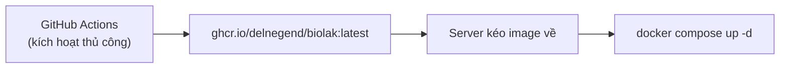

# Triển khai

## Tổng quan

BioLAK chạy dưới dạng container Docker sử dụng chế độ đầu ra **standalone** của Next.js. Quy trình triển khai:



Docker image bao gồm ứng dụng Next.js đã biên dịch, các API Payload REST/GraphQL và bảng quản trị — mọi thứ cần thiết để vận hành trang web. Cơ sở dữ liệu SQLite và các tệp phương tiện được tải lên sẽ được lưu trữ cố định trên máy chủ thông qua các volume được gắn kết.

Hai tệp Docker Compose được cung cấp:

| Tệp                           | Mục đích                               | Hành vi build                       |
| ----------------------------- | -------------------------------------- | ----------------------------------- |
| `docker-compose.staging.yaml` | Kiểm thử cục bộ trước khi chạy thực tế | Build cục bộ từ mã nguồn            |
| `docker-compose.example.yaml` | Môi trường thực tế (Production)        | Kéo image đã build sẵn từ `ghcr.io` |

---

## Điều kiện tiên quyết

- Một máy chủ Linux (khuyên dùng Debian 13+ hoặc Ubuntu 24.04+).
- [Docker Engine](https://docs.docker.com/engine/install) (kèm plugin `compose`) hoặc [Podman](https://podman.io/docs/installation).
- `just` (trình chạy tác vụ) và `zstd` (công cụ nén).
- Quyền truy cập [GitHub Container Registry](https://ghcr.io) (để kéo các image đã build sẵn).

Cài đặt các gói cần thiết trên Debian/Ubuntu:

```bash
sudo apt update && sudo apt install -y curl ca-certificates zstd podman just
```

---

## Cấu trúc thư mục dịch vụ

Tất cả các tệp ứng dụng nằm trong thư mục `~/biolak`:

```text
~/biolak/
├── docker-compose.yaml      # Điều phối dịch vụ (chứa các biến môi trường)
├── .justfile               # Trình chạy tác vụ production (bí danh: just)
└── data/                   # Dữ liệu cố định
    ├── media/              # Các tệp phương tiện đã tải lên
    └── data.prod.sqlite3        # Cơ sở dữ liệu SQLite
```

### Thiết lập ban đầu

```bash
mkdir -p ~/biolak/data/media
cd ~/biolak
```

---

## Cấu hình

### 1. Tải các tệp mẫu

```bash
curl -fsSL -o ~/biolak/docker-compose.yaml https://github.com/Delnegend/biolak/raw/refs/heads/main/docker-compose.example.yaml
curl -fsSL -o ~/biolak/.justfile https://github.com/Delnegend/biolak/raw/refs/heads/main/.prod.justfile
```

### 2. Bảo mật quyền hạn tệp

```bash
chmod 600 ~/biolak/docker-compose.yaml ~/biolak/.justfile
```

### 3. Tạo các mã bí mật (Secrets)

Sử dụng `openssl rand -base64 32` để tạo các giá trị duy nhất cho:

- `PAYLOAD_SECRET`
- `CRON_SECRET`
- `PREVIEW_SECRET`

### 4. Chỉnh sửa docker-compose.yaml

| Biến                     | Giá trị                            | Ghi chú                                       |
| ------------------------ | ---------------------------------- | --------------------------------------------- |
| `DATABASE_URI`           | `file:/app/data/data.prod.sqlite3` | Trỏ đến volume lưu trữ cố định                |
| `NEXT_PUBLIC_SERVER_URL` | `https://yourdomain.com`           | Ảnh hưởng đến thẻ SEO, sitemap, URL xem trước |
| `PAYLOAD_SECRET`         | _(đã tạo)_                         | Mã bí mật mã hóa                              |
| `CRON_SECRET`            | _(đã tạo)_                         | Token Bearer cho các endpoint công việc       |
| `PREVIEW_SECRET`         | _(đã tạo)_                         | Mã bí mật dùng chung để xem trước bản nháp    |
| `SMTP_*`                 | _(SMTP của bạn)_                   | Tùy chọn: người gửi, host, port, user, pass   |
| `TUNNEL_TOKEN`           | _(Cloudflare)_                     | Chỉ cần nếu sử dụng `cloudflared`             |

Các giá trị mặc định cho production nằm trong phần `environment` của `docker-compose.yaml`. Hãy dán các mã bí mật đã tạo vào đó.

---

## Môi trường thực tế (`docker-compose.yaml`)

```bash
docker compose up -d
```

Lệnh này kéo image đã build sẵn từ `ghcr.io`. Tệp compose bao gồm một sidecar `cloudflared` để truy cập công khai an toàn.

- Cơ sở dữ liệu tại `./data/data.prod.sqlite3`
- Cổng không được mở ra máy chủ (lưu lượng truy cập đi qua Cloudflare Tunnel hoặc reverse proxy của bạn)
- SSL/kết thúc mã hóa được xử lý bởi reverse proxy.

---

## Quy trình CI/CD

### CI (`ci.yml`)

Kích hoạt mỗi khi có push/PR vào nhánh `main`. Chạy:

1. `just check` — kiểm tra lỗi (lint), định dạng, kiểm tra kiểu dữ liệu
2. `just build` — build production thử nghiệm với DB SQLite tạm thời

Điều này đảm bảo ứng dụng build thành công trước khi bất kỳ image nào được xuất bản.

### Xuất bản Image (`publish-image.yaml`)

Được kích hoạt thủ công từ GitHub Actions:

1. Đi tới **Actions** → **Publish Docker Image** → **Run workflow**.
2. Quy trình sẽ build image và đẩy hai tag lên `ghcr.io/delnegend/biolak`:
    - `:latest` — luôn là bản build gần nhất
    - `:{commit-sha}` — gắn với commit chính xác đó

Các image được nén với `zstd` mức 9 để tiết kiệm không gian lưu trữ.

---

## Triển khai

### Khởi động Stack

```bash
cd ~/biolak
docker compose pull     # đảm bảo lấy image mới nhất
docker compose up -d    # khởi động các dịch vụ
```

### Xác minh

```bash
docker compose ps
curl -f http://localhost:3000/api/status
```

Endpoint `/api/status` sẽ trả về `200 OK` khi máy chủ hoạt động bình thường.

### Theo dõi Logs

```bash
docker compose logs -f biolak
```

---

## Reverse Proxy & SSL/TLS

Ứng dụng **không** xử lý SSL/TLS nguyên bản. Bạn phải kết thúc TLS tại một reverse proxy.

### Khuyên dùng: Cloudflare Tunnel

Tệp compose production bao gồm một sidecar `cloudflared`. Nó tạo ra một đường hầm (tunnel) ra ngoài an toàn nên không cần quy tắc tường lửa cho lưu lượng vào.

Đường hầm này được **quản lý từ xa** — bạn tạo nó trong bảng điều khiển Cloudflare và máy chủ chỉ cần chạy với token.

1. Truy cập [Cloudflare dashboard](https://dash.cloudflare.com/) → **Networking** → **Tunnels** → **Create a tunnel**.
2. Đặt tên (ví dụ: `biolak`), sau đó sao chép token từ lệnh cài đặt được hiển thị.
3. Dán token vào biến `TUNNEL_TOKEN` trong `docker-compose.yaml`.
4. Vẫn trong bảng điều khiển, chọn tunnel → tab **Routes** → **Add route** → **Published application**.
5. Thiết lập subdomain/domain và trong phần **Service URL** nhập `http://biolak:3000`. Lưu lại.

Container `cloudflared` trong stack sẽ khởi động với token và tự động kết nối.

**Liên kết:** [Tạo tunnel (dashboard)](https://developers.cloudflare.com/cloudflare-one/networks/connectors/cloudflare-tunnel/get-started/create-remote-tunnel/) · [Xuất bản ứng dụng](https://developers.cloudflare.com/cloudflare-one/networks/connectors/cloudflare-tunnel/get-started/create-remote-tunnel/#2a-publish-an-application) · [Khắc phục sự cố tunnel](https://developers.cloudflare.com/cloudflare-one/networks/connectors/cloudflare-tunnel/troubleshoot-tunnels/common-errors/)

### Reverse Proxy tùy chỉnh (Nginx, Caddy, v.v.)

1. Chú thích (comment) hoặc xóa dịch vụ `cloudflared` trong `docker-compose.yaml`.
2. **Bỏ chú thích phần `ports`** để mở cổng `3000` ra máy chủ.
3. Cấu hình proxy của bạn để kết thúc SSL (ví dụ: Let's Encrypt) và chuyển tiếp đến:
    - Mạng Docker: `http://biolak:3000`
    - Mạng Host: `http://localhost:3000`

---

## Bảo trì

Các lệnh bảo trì production được chạy thông qua `just` bên trong thư mục `~/biolak`. Các lệnh này tác động trực tiếp lên dữ liệu thực tế — **không chạy chúng bên ngoài `~/biolak`.**

### Sao lưu (Backup)

```bash
cd ~/biolak
just backup
```

Dừng các dịch vụ, lưu Docker image, nén toàn bộ thư mục `~/biolak` (ngoại trừ các bản sao lưu trước đó), khởi động lại dịch vụ, sau đó dọn dẹp.

Đầu ra: `~/biolak-YYYY-MM-DD_HH-MM-SS.tar.zst`

### Khôi phục (Restore)

```bash
cd ~/biolak
just restore
```

Dừng các dịch vụ, giải nén tệp sao lưu mới nhất, tải Docker image đã lưu và khởi động lại.

### Cập nhật (Update)

```bash
cd ~/biolak
just update
```

Chạy `backup` trước, sau đó kéo `ghcr.io/delnegend/biolak:latest` và khởi động lại.

### Hoàn tác bản cập nhật lỗi (Rolling Back)

```bash
cd ~/biolak
docker compose down
just restore    # khôi phục bản sao lưu được tạo bởi 'just update'
```

Nếu `just update` thất bại trước khi kịp sao lưu:

```bash
docker compose down
# Xác định tag image hoạt động tốt gần nhất
docker images ghcr.io/delnegend/biolak
# Chạy một tag cụ thể
docker compose -f docker-compose.yaml run --rm biolak # kiểm tra trước
# Hoặc sửa docker-compose.yaml để ghim một tag cũ hơn
```

---

## Di chuyển sang máy chủ mới

1. Hoàn thành **Điều kiện tiên quyết** và **Thiết lập ban đầu** trên máy chủ mới.
2. Chuyển tệp sao lưu mới nhất vào thư mục `/tmp` trên máy chủ mới.
3. Giải nén vào thư mục gốc:

    ```bash
    sudo tar -xf /tmp/biolak-*.tar.zst -C /
    ```

4. Sửa quyền sở hữu:

    ```bash
    sudo chown -R 1000:1000 ~/biolak
    ```

5. Khởi động stack:

    ```bash
    cd ~/biolak
    docker compose up -d
    ```

---

## Khắc phục sự cố

| Vấn đề                          | Cách khắc phục                                                                              |
| ------------------------------- | ------------------------------------------------------------------------------------------- |
| Container thoát ngay lập tức    | Kiểm tra logs: `docker compose logs biolak`                                                 |
| Lỗi `DATABASE_URI`              | Đảm bảo thư mục `data/` tồn tại và có quyền ghi cho UID 1000                                |
| Lỗi kéo image từ `ghcr.io`      | Chạy `docker login ghcr.io` với token GitHub có quyền `packages:read`                       |
| Cổng 3000 đang được sử dụng     | Tắt tiến trình đó hoặc thay đổi ánh xạ cổng host trong `docker-compose.yaml`                |
| Bảng quản trị trả về lỗi 404    | Đảm bảo `PAYLOAD_SECRET` trong compose khớp với mã đã dùng khi thiết lập ban đầu            |
| Cloudflare Tunnel không kết nối | Xác minh `TUNNEL_TOKEN` đã được đặt và tunnel đã được cấu hình trong dashboard              |
| Di chuyển bị kẹt / DB bị khóa   | Dừng container, xóa `data.prod.sqlite3-wal` và `data.prod.sqlite3-shm`, khởi động lại       |
| Tệp sao lưu quá lớn             | Các Docker image cũ tích tụ — hãy dọn dẹp bằng `docker image prune` trước khi `just backup` |

---

## Lưu ý về bảo mật

- **Secrets trong tệp compose:** `docker-compose.yaml` được đặt `chmod 600` — chỉ chủ sở hữu tệp mới có thể đọc.
- **Người dùng không phải root:** Docker runtime chạy dưới quyền `node` (UID 1000), không phải root.
- **Cách ly mạng:** Compose production sử dụng một mạng bridge `biolak-network` riêng biệt. Sidecar `cloudflared` là dịch vụ duy nhất tiếp xúc với internet.
- **Cập nhật thường xuyên:** Chạy `just update` định kỳ để nhận các bản vá bảo mật trong image nền và các thư viện phụ thuộc.
- **Token GitHub:** Token dùng cho `docker login ghcr.io` nên có phạm vi tối thiểu: `packages:read`. Cân nhắc sử dụng token tinh chỉnh (fine-grained token) chỉ giới hạn trong kho lưu trữ này.
- **Sao lưu cơ sở dữ liệu:** Lưu trữ các tệp sao lưu (`tzst`) bên ngoài máy chủ (ví dụ: lưu trữ đám mây) để phục hồi sau thảm họa.

---

## Bản sao lưu máy chủ mới nhất

Tải xuống bản sao lưu production mới nhất: [Liên kết sao lưu mới nhất](https://drive.google.com/file/d/186M2WAzDKtDGF27rO2ozAtVxkL8bnqL2/view?usp=sharing)
