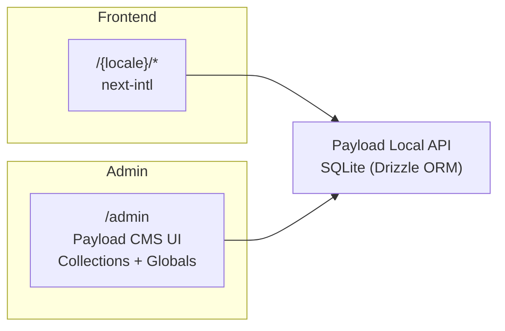

# Development

## Overview

BioLAK is a multilingual (English / Vietnamese) e‑commerce + content site built on **Payload CMS 3** + **Next.js 16** with **SQLite** via Drizzle ORM. The admin panel lives at `/admin`, the public frontend at `/{locale}`.



---

## Stack

- **Next.js** (App Router) + **React** — https://nextjs.org/docs
- **Payload CMS 3** (headless CMS, admin panel, REST/GraphQL) — https://payloadcms.com/docs
- **SQLite** via `@payloadcms/db-sqlite` + Drizzle ORM — https://payloadcms.com/docs/database/sqlite
- **Lexical rich text** via `@payloadcms/richtext-lexical` — https://payloadcms.com/docs/rich-text/overview
- **next-intl** (frontend i18n) — https://next-intl.dev
- **Tailwind CSS** — https://tailwindcss.com/docs
- **shadcn/ui** (Radix primitives + CVA) — https://ui.shadcn.com
- **TypeScript** (strict mode)

**Package manager:** pnpm. **Task runner:** `just` (alias `j` inside dev container).

> Exact versions are pinned in `package.json`.

---

## Prerequisites

- [Docker Engine](https://docs.docker.com/engine/) or [Podman](https://podman.io/docs/installation)
- [VS Code](https://code.visualstudio.com/)
- [VS Code Dev Containers extension](https://marketplace.visualstudio.com/items?itemName=ms-vscode-remote.remote-containers)
- [just](https://github.com/casey/just) (task runner)

---

## Setup

1. **Reopen in container:** Command Palette (F1 / Ctrl+Shift+P) → "Dev Containers: Reopen in Container".

2. **Copy environment:**

    ```bash
    cp .env.example .env
    ```

3. **Generate types, DB schema, and import map:**

    ```bash
    just gen-stuffs
    ```

4. **Start the dev server:**

    ```bash
    just dev
    ```

5. Visit `http://localhost:3000` (frontend) and `http://localhost:3000/admin` (admin panel).

### Using Production Data (Optional)

Stop the production instance, copy its database file (e.g. `data.prod.sqlite3`) into `/workspaces/biolak/data/`, then restart.

### Auto-Login

After creating the first admin user, set `DEV_EMAIL` and `DEV_PASSWORD` in `.env` for automatic login on the next restart.

---

## Project Structure

```
src/
├── access/                  # Payload access control functions
│   ├── allow.ts             # allow(Role.Admin, Role.Public, ...)
│   └── adminOrPublished.ts  # public reads published, admins see all
├── app/
│   ├── (payload)/           # Payload HTTP layer — admin, REST, GraphQL
│   └── [locale]/            # Frontend routes (en, vi)
│       ├── layout.tsx       # Root frontend layout (NextIntlClientProvider)
│       ├── page.tsx         # Homepage
│       ├── [slug]/          # Dynamic page routes
│       ├── post/            # Post detail
│       ├── posts/           # Post listing
│       ├── product/         # Product detail
│       ├── category/        # Category listing
│       ├── checkout/        # Checkout flow
│       └── search/          # Search page
├── blocks/                  # 28 block types (Banner, Content, ProductsCarousel…)
├── collections/             # 12 Payload collections
├── components/              # Shared React components
│   └── ui/                  # shadcn/ui primitives (Button, Input, etc.)
├── fields/                  # Reusable Payload field configs (slug, link, metaTab…)
├── globals/                 # 10 Payload singletons (Header, Footer, General…)
├── hooks/                   # Custom React hooks + Payload hook definitions
├── i18n/                    # next-intl routing & config
├── migrations/              # Drizzle migrations (auto-generated)
├── plugins/                 # Payload plugin configuration
├── utilities/               # Shared utilities (getURL, logger, generateMeta…)
├── payload.config.ts        # Main Payload config
├── payload-types.ts         # Auto-generated TS types — DO NOT EDIT
└── payload-generated-schema.ts  # Auto-generated Drizzle schema — DO NOT EDIT
```

### Auto-Generated Files

These files are regenerated by `just gen-stuffs`. Do not edit them manually:

- `src/payload-types.ts`
- `src/payload-generated-schema.ts`
- `src/app/(payload)/admin/importMap.js`

---

## Payload CMS Concepts

### Collections

A [collection](https://payloadcms.com/docs/configuration/collections) is a group of documents sharing a schema. Each generates REST + GraphQL APIs automatically.

All collections live under `src/collections/` — each in its own directory with `config.ts` (schema) and `slug.ts` (slug constant). Example pattern:

```ts
// src/collections/Pages/index.ts  (simplified)
export const PagesCollection: CollectionConfig<'pages'> = {
  slug: 'pages',
  access: {
    read: adminOrPublished,              // public → published only
    create: allow(Role.Admin, Role.ContentManager),
    update: allow(Role.Admin, Role.ContentManager),
    delete: allow(Role.Admin, Role.ContentManager),
  },
  admin: { useAsTitle: 'title', livePreview: { url: … } },
  fields: [ /* tabs, groups, blocks */ ],
  hooks: {
    beforeChange: [populatePublishedAt],
    afterChange:  [revalidatePage],
    afterDelete:  [revalidateDelete],
  },
  versions: { drafts: { autosave: { interval: 100 } } },
}
```

**Links:** [Collection config](https://payloadcms.com/docs/configuration/collections) · [Access control](https://payloadcms.com/docs/access-control/collections) · [Hooks](https://payloadcms.com/docs/hooks/collections) · [Admin options](https://payloadcms.com/docs/configuration/collections#admin-options)

### Globals

[Globals](https://payloadcms.com/docs/configuration/globals) are singletons — exactly one document. Used for site-wide settings (Header, Footer, Payment config, etc.).

All globals live under `src/globals/` — each in its own directory following the same field/hook/access pattern as collections.

**Links:** [Global config](https://payloadcms.com/docs/configuration/globals) · [Global hooks](https://payloadcms.com/docs/hooks/globals)

### Blocks

[Blocks](https://payloadcms.com/docs/fields/blocks) are modular content components assembled by editors. The Pages collection uses them via the `pageLayout` blocks field.

Each block is a directory under `src/blocks/` containing `config.ts` (schema) and a React component. Rendering is dispatched by `src/blocks/RenderBlocks.tsx`.

### Fields

Payload provides [many field types](https://payloadcms.com/docs/fields/overview). Custom reusable field configs live in `src/fields/` (slug generation, link groups, SEO meta tab, etc.).

### Hooks

[Hooks](https://payloadcms.com/docs/hooks/overview) let you run logic at document lifecycle events (`beforeChange`, `afterChange`, `afterDelete`, etc.). See `src/hooks/` and per-collection hook directories for examples.

Hooks that don't return a Promise (fire-and-forget) won't block the request.

**Links:** [Collection hooks](https://payloadcms.com/docs/hooks/collections) · [Global hooks](https://payloadcms.com/docs/hooks/globals) · [Field hooks](https://payloadcms.com/docs/hooks/fields)

### Access Control

[Access control](https://payloadcms.com/docs/access-control/overview) uses a role-based helper in `src/access/allow.ts`:

```ts
// Usage in any collection or global
  access: {
    read:   allow(Role.Public),
    create: allow(Role.Admin, Role.ContentManager),
    update: allow(Role.Admin, Role.ContentManager),
    delete: allow(Role.Admin, Role.ContentManager),
  }
```

Four roles exist: `Admin`, `ContentManager`, `SalesManager`, `Public`. There is also a special `NoOne` role that denies all access. The `adminOrPublished` helper lets admins see drafts while the public only sees published documents.

### Plugins

[Plugins](https://payloadcms.com/docs/plugins/overview) configured in `src/plugins/index.ts` include SEO, Redirects, Search, Form Builder, and Nested Docs. See the source for details.

---

## Internationalization (i18n)

Three independent i18n layers:

| Layer                  | Mechanism                                                                        | Scope                                   |
| ---------------------- | -------------------------------------------------------------------------------- | --------------------------------------- |
| **Admin panel UI**     | [Payload `i18n`](https://payloadcms.com/docs/configuration/i18n)                 | Labels, descriptions inside `/admin`    |
| **Dynamic content**    | [Payload `localization`](https://payloadcms.com/docs/configuration/localization) | Page body, product descriptions, etc.   |
| **Frontend static UI** | [`next-intl`](https://next-intl.dev) with locale path prefixing                  | Buttons, errors, alt texts, form labels |

### Locale Path Prefixing

```
/en          → English homepage
/en/products → English products page
/vi          → Vietnamese homepage
/vi/san-pham → Vietnamese products page
```

- **Middleware** (`proxy.ts` at repo root — named this way, not `middleware.ts`) detects the user's language from `Accept-Language` and redirects `/` → `/{locale}`.
- The choice is persisted in a cookie.
- Admin panel stays at `/admin` (no prefix).

### Translating UI Strings (next-intl)

Message files live in `messages/{locale}.json`:

```json
{
	"HomePage": {
		"title": "Hello world!"
	}
}
```

**Server components:**

```tsx
import { getTranslations } from 'next-intl/server'

export default async function MyComponent() {
	const t = await getTranslations('namespace')
	return <button>{t('buttonLabel')}</button>
}
```

**Client components:**

```tsx
import { useTranslations } from 'next-intl'

export default function MyComponent() {
	const t = useTranslations('namespace')
	return <button>{t('buttonLabel')}</button>
}
```

### Adding a New Language

1. Add locale to `src/i18n/routing.ts` (`locales` array + `Lang` enum).
2. Add to `localization.locales` and `i18n.supportedLanguages` in `src/payload.config.ts`.
3. Create `messages/{code}.json` with all required keys.

---

## Commands

Inside the dev container, run via `just` (or `j`):

| Command                  | What it does                                                               | When to run                    |
| ------------------------ | -------------------------------------------------------------------------- | ------------------------------ |
| `just dev`               | Start dev server (pnpm next dev)                                           | Daily development              |
| `just build`             | Full production build (ephemeral SQLite DB)                                | Before deploy, verify build    |
| `just check`             | `eslint --fix` → `prettier --write` → `tsc --noEmit`                       | Before committing              |
| `just gen-stuffs`        | Generate `payload-types.ts`, `payload-generated-schema.ts`, `importMap.js` | After schema changes           |
| `just db-create-migrate` | Create a new DB migration                                                  | After field/collection changes |

Outside the dev container, the Dockerfile handles everything:

```bash
docker build . -t biolak:latest
```

---

## Environment Variables

See `.env.example` for the full list with defaults. Read env vars directly via `process.env` (the `env()` helper is not used).

---

## Code Conventions

- **Prettier:** tabs (width 4), single quotes, no semicolons, printWidth 100
- **ESLint:** `no-console: error` — use `payload.logger` (server) or `newLogger` from `@/utilities/logger` (client)
- **Imports:** auto-sorted by `eslint-plugin-simple-import-sort` (enforced)
- **Components:** prefix with `INTERNAL_` for single-use client components
- **URLs:** use `getServerSideURL()` from `@/utilities/getURL`, not hardcoded strings
- **Path aliases:** `@/*` → `src/*`, `@payload-config` → `src/payload.config.ts`
- **TypeScript:** strict mode; expect `@ts-expect-error` on `prodMigrations` (known Drizzle/Payload type divergence)

---

## Frontend Development

- **Routing:** All public routes under `src/app/[locale]/` use Next.js App Router.
- **Data fetching:** Use `getPayload()` in server components to call the [Local API](https://payloadcms.com/docs/local-api/overview) directly — no REST/GraphQL needed server-side.
- **Rich text:** Rendered via `src/components/RichText/`.
- **Blocks:** Dispatched via `src/blocks/RenderBlocks.tsx`.
- **Media:** Handled by `src/components/Media/`.
- **SEO:** Managed by the SEO plugin + `src/utilities/generateMeta.ts`.
- **Live preview:** Configured per-collection in `admin.livePreview.url`.

---

## Database & Migrations

The project uses **SQLite** via `@payloadcms/db-sqlite` (Drizzle ORM under the hood). You rarely interact with Drizzle directly — Payload manages it.

- **Create a migration:** `just db-create-migrate`
- **Migrations live in:** `src/migrations/`
- **CI build:** uses `/tmp/biolak-ci.sqlite3` (ephemeral)

### Drizzle Conflict Resolution

If the terminal's DB conflict resolver is unresponsive:

1. Press `Ctrl+C`, then run `j dev` to restart.
2. Visit `http://localhost:3000` (triggers first schema fetch).
3. Visit `http://localhost:3000/admin` (triggers second schema fetch). The resolver should now be interactive.

**Links:** [Payload database docs](https://payloadcms.com/docs/database/overview) · [Payload SQLite](https://payloadcms.com/docs/database/sqlite) · [Payload migrations](https://payloadcms.com/docs/database/migrations)

---

## Admin Panel

Located at `/admin`. It is auto-generated from your Payload config. To customize:

- **Components:** Swap via `admin.components` in collection/global configs.
- **Import map:** Auto-generated at `src/app/(payload)/admin/importMap.js`.
- **Theme:** Light/dark toggle per user.

**Links:** [Admin panel docs](https://payloadcms.com/docs/admin/overview) · [Custom components](https://payloadcms.com/docs/custom-components/overview)

---

## Common Workflows

### Adding a New Collection

1. Create `src/collections/MyCollection/` with `config.ts` and `slug.ts`.
2. Register in `src/payload.config.ts` `collections` array.
3. Run `just gen-stuffs`.
4. Run `just db-create-migrate`.

### Adding a New Block

1. Create `src/blocks/MyBlock/` with `config.ts` and `Component.tsx`.
2. Register the block in `src/blocks/RenderBlocks.tsx`.
3. Add it to the `blocks` array on the target collection (e.g. Pages `pageLayout`).

### Adding a Field to an Existing Collection/Global

1. Edit the `fields` array in the config file.
2. Run `just gen-stuffs`.
3. Run `just db-create-migrate`.

---

## Testing

No test framework is configured. Manual verification:

- Run `just dev` and check the frontend at `http://localhost:3000`.
- Check the admin panel at `http://localhost:3000/admin`.
- Run `just check` before committing (lint + format + type-check).

---

## Deployment

Deployment is Docker-based. See [`docs/deployment.md`](./deployment.md) for full production instructions.

### Staging

`docker-compose.staging.yaml` builds the image locally from source for testing:

```bash
docker compose -f docker-compose.staging.yaml up -d
```

- Builds locally (`pull_policy: never`)
- Database at `./data/data.prod.sqlite3`
- Port `3000` exposed to host
- No SSL or reverse proxy configured

### Production

- **`docker-compose.example.yaml`** — copy to \`docker-compose.yaml\`, configure secrets, then `docker compose up -d`.
- **Official build method:** the GitHub Actions workflow (`.github/workflows/publish-image.yaml`) builds and pushes to `ghcr.io`. The server pulls the latest image and restarts.

See [`docs/deployment.md`](./deployment.md) for full production setup.

---

## Troubleshooting

| Problem                                | Fix                                                                   |
| -------------------------------------- | --------------------------------------------------------------------- |
| `Cannot find module '@payloadcms/...'` | Run `pnpm install`                                                    |
| Type errors after schema change        | Run `just gen-stuffs`                                                 |
| `DATABASE_URI` not set                 | Copy `.env.example` to `.env` and fill in                             |
| Migration conflicts / resolver stuck   | See [Drizzle Conflict Resolution](#drizzle-conflict-resolution) above |
| Port 3000 in use                       | Kill existing process on :3000 or set `PORT` env var                  |
| Admin panel not loading                | Check browser console; ensure DB migration ran                        |
| Translations not updating              | Restart dev server after changing `messages/*.json`                   |
| `just` command not found               | Install via `apt install just` or your package manager                |
