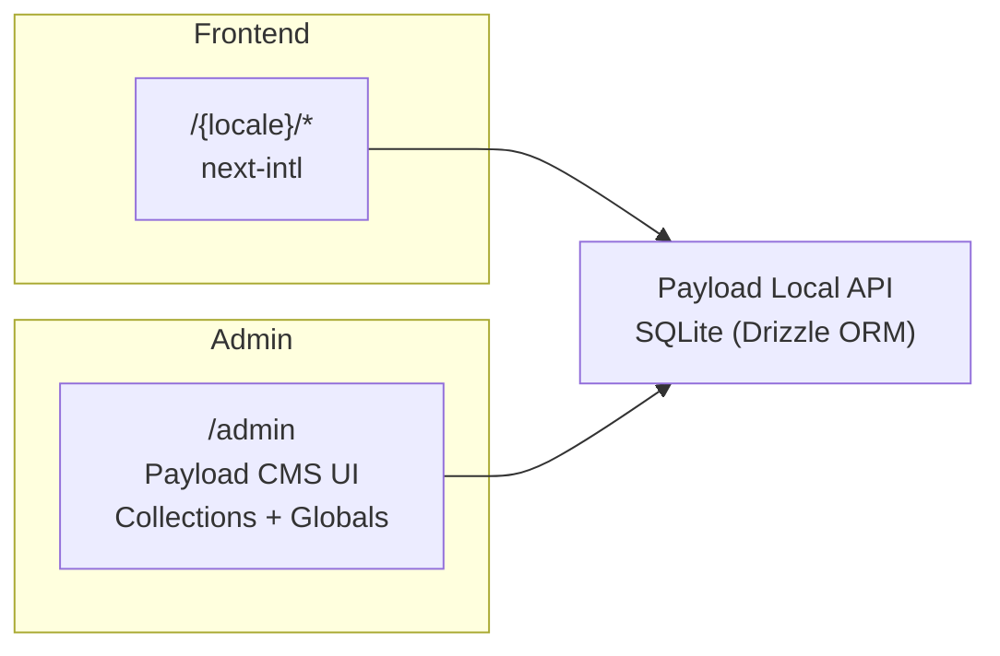

# Phát triển

## Tổng quan

BioLAK là một trang web thương mại điện tử + nội dung đa ngôn ngữ (tiếng Anh / tiếng Việt) được xây dựng trên **Payload CMS 3** + **Next.js 16** với **SQLite** thông qua Drizzle ORM. Bảng quản trị nằm tại `/admin`, frontend công khai tại `/{locale}`.



---

## Công nghệ sử dụng (Stack)

- **Next.js** (App Router) + **React** — https://nextjs.org/docs
- **Payload CMS 3** (headless CMS, bảng quản trị, REST/GraphQL) — https://payloadcms.com/docs
- **SQLite** thông qua `@payloadcms/db-sqlite` + Drizzle ORM — https://payloadcms.com/docs/database/sqlite
- **Lexical rich text** thông qua `@payloadcms/richtext-lexical` — https://payloadcms.com/docs/rich-text/overview
- **next-intl** (i18n cho frontend) — https://next-intl.dev
- **Tailwind CSS** — https://tailwindcss.com/docs
- **shadcn/ui** (Radix primitives + CVA) — https://ui.shadcn.com
- **TypeScript** (chế độ nghiêm ngặt)

**Trình quản lý gói:** pnpm. **Trình chạy tác vụ:** `just` (bí danh `j` bên trong dev container).

> Các phiên bản chính xác được ghim trong `package.json`.

---

## Điều kiện tiên quyết

- [Docker Engine](https://docs.docker.com/engine/) hoặc [Podman](https://podman.io/docs/installation)
- [VS Code](https://code.visualstudio.com/)
- [VS Code Dev Containers extension](https://marketplace.visualstudio.com/items?itemName=ms-vscode-remote.remote-containers)
- [just](https://github.com/casey/just) (trình chạy tác vụ)

---

## Thiết lập

1. **Mở lại trong container:** Command Palette (F1 / Ctrl+Shift+P) → "Dev Containers: Reopen in Container".

2. **Sao chép môi trường:**

    ```bash
    cp .env.example .env
    ```

3. **Tạo các kiểu dữ liệu (types), sơ đồ DB và bản đồ nhập (import map):**

    ```bash
    just gen-stuffs
    ```

4. **Khởi động máy chủ phát triển:**

    ```bash
    just dev
    ```

5. Truy cập `http://localhost:3000` (frontend) và `http://localhost:3000/admin` (bảng quản trị).

### Sử dụng dữ liệu thực tế (Tùy chọn)

Dừng phiên bản đang chạy, sao chép tệp cơ sở dữ liệu (ví dụ: `data.prod.sqlite3`) vào `/workspaces/biolak/data/`, sau đó khởi động lại.

### Tự động đăng nhập

Sau khi tạo người dùng quản trị đầu tiên, hãy thiết lập `DEV_EMAIL` và `DEV_PASSWORD` trong `.env` để tự động đăng nhập trong lần khởi động tiếp theo.

---

## Cấu trúc dự án

```
src/
├── access/                  # Các hàm kiểm soát quyền truy cập Payload
│   ├── allow.ts             # allow(Role.Admin, Role.Public, ...)
│   └── adminOrPublished.ts  # công khai đọc bài đã đăng, admin xem tất cả
├── app/
│   ├── (payload)/           # Lớp HTTP của Payload — admin, REST, GraphQL
│   └── [locale]/            # Các tuyến đường Frontend (en, vi)
│       ├── layout.tsx       # Bố cục frontend gốc (NextIntlClientProvider)
│       ├── page.tsx         # Trang chủ
│       ├── [slug]/          # Các tuyến đường trang động
│       ├── post/            # Chi tiết bài viết
│       ├── posts/           # Danh sách bài viết
│       ├── product/         # Chi tiết sản phẩm
│       ├── category/        # Danh sách danh mục
│       ├── checkout/        # Quy trình thanh toán
│       └── search/          # Trang tìm kiếm
├── blocks/                  # 28 loại khối (Banner, Nội dung, Carousel sản phẩm…)
├── collections/             # 12 bộ sưu tập Payload
├── components/              # Các thành phần React dùng chung
│   └── ui/                  # Các thành phần cơ bản shadcn/ui (Button, Input, v.v.)
├── fields/                  # Cấu hình trường Payload có thể tái sử dụng (slug, link, metaTab…)
├── globals/                 # 10 đối tượng đơn lẻ Payload (Header, Footer, General…)
├── hooks/                   # React hooks tùy chỉnh + định nghĩa Payload hook
├── i18n/                    # Cấu hình & định tuyến next-intl
├── migrations/              # Các bản di chuyển Drizzle (tự động tạo)
├── plugins/                 # Cấu hình plugin Payload
├── utilities/               # Các tiện ích dùng chung (getURL, logger, generateMeta…)
├── payload.config.ts        # Cấu hình chính của Payload
├── payload-types.ts         # Các kiểu TS tự động tạo — KHÔNG CHỈNH SỬA
└── payload-generated-schema.ts  # Sơ đồ Drizzle tự động tạo — KHÔNG CHỈNH SỬA
```

### Các tệp tự động tạo

Các tệp này được tạo lại bởi lệnh `just gen-stuffs`. Đừng chỉnh sửa chúng thủ công:

- `src/payload-types.ts`
- `src/payload-generated-schema.ts`
- `src/app/(payload)/admin/importMap.js`

---

## Các khái niệm Payload CMS

### Collections (Bộ sưu tập)

Một [collection](https://payloadcms.com/docs/configuration/collections) là một nhóm các tài liệu chia sẻ chung một sơ đồ (schema). Mỗi bộ sưu tập sẽ tự động tạo ra các API REST + GraphQL.

Tất cả các bộ sưu tập nằm trong `src/collections/` — mỗi bộ nằm trong thư mục riêng với `config.ts` (sơ đồ) và `slug.ts` (hằng số slug). Ví dụ:

```ts
// src/collections/Pages/index.ts  (rút gọn)
export const PagesCollection: CollectionConfig<'pages'> = {
  slug: 'pages',
  access: {
    read: adminOrPublished,              // công khai → chỉ xem bài đã đăng
    create: allow(Role.Admin, Role.ContentManager),
    update: allow(Role.Admin, Role.ContentManager),
    delete: allow(Role.Admin, Role.ContentManager),
  },
  admin: { useAsTitle: 'title', livePreview: { url: … } },
  fields: [ /* tabs, groups, blocks */ ],
  hooks: {
    beforeChange: [populatePublishedAt],
    afterChange:  [revalidatePage],
    afterDelete:  [revalidateDelete],
  },
  versions: { drafts: { autosave: { interval: 100 } } },
}
```

**Liên kết:** [Cấu hình Collection](https://payloadcms.com/docs/configuration/collections) · [Kiểm soát truy cập](https://payloadcms.com/docs/access-control/collections) · [Hooks](https://payloadcms.com/docs/hooks/collections) · [Tùy chọn Admin](https://payloadcms.com/docs/configuration/collections#admin-options)

### Globals (Toàn cục)

[Globals](https://payloadcms.com/docs/configuration/globals) là các đối tượng đơn lẻ (singletons) — chỉ có duy nhất một tài liệu. Được sử dụng cho các thiết lập toàn trang (Header, Footer, Cấu hình thanh toán, v.v.).

Tất cả các globals nằm trong `src/globals/` — mỗi cái nằm trong thư mục riêng tuân theo cùng một mô hình trường/hook/truy cập như các bộ sưu tập.

**Liên kết:** [Cấu hình Global](https://payloadcms.com/docs/configuration/globals) · [Global hooks](https://payloadcms.com/docs/hooks/globals)

### Blocks (Khối)

[Blocks](https://payloadcms.com/docs/fields/blocks) là các thành phần nội dung mô-đun được lắp ghép bởi biên tập viên. Bộ sưu tập Pages sử dụng chúng thông qua trường khối `pageLayout`.

Mỗi khối là một thư mục trong `src/blocks/` chứa `config.ts` (sơ đồ) và một thành phần React. Việc hiển thị được điều phối bởi `src/blocks/RenderBlocks.tsx`.

### Fields (Trường)

Payload cung cấp [nhiều loại trường](https://payloadcms.com/docs/fields/overview). Các cấu hình trường tùy chỉnh có thể tái sử dụng nằm trong `src/fields/` (tạo slug, nhóm liên kết, tab SEO meta, v.v.).

### Hooks

[Hooks](https://payloadcms.com/docs/hooks/overview) cho phép bạn chạy logic tại các sự kiện vòng đời của tài liệu (`beforeChange`, `afterChange`, `afterDelete`, v.v.). Xem `src/hooks/` và các thư mục hook theo từng bộ sưu tập để biết ví dụ.

Các hook không trả về Promise (chạy và quên) sẽ không làm nghẽn yêu cầu (request).

**Liên kết:** [Collection hooks](https://payloadcms.com/docs/hooks/collections) · [Global hooks](https://payloadcms.com/docs/hooks/globals) · [Field hooks](https://payloadcms.com/docs/hooks/fields)

### Kiểm soát truy cập (Access Control)

[Kiểm soát truy cập](https://payloadcms.com/docs/access-control/overview) sử dụng một trình hỗ trợ dựa trên vai trò trong `src/access/allow.ts`:

```ts
// Sử dụng trong bất kỳ bộ sưu tập hoặc global nào
  access: {
    read:   allow(Role.Public),
    create: allow(Role.Admin, Role.ContentManager),
    update: allow(Role.Admin, Role.ContentManager),
    delete: allow(Role.Admin, Role.ContentManager),
  }
```

Có bốn vai trò: `Admin`, `ContentManager`, `SalesManager`, `Public`. Ngoài ra còn có vai trò đặc biệt `NoOne` từ chối mọi quyền truy cập. Trình hỗ trợ `adminOrPublished` cho phép admin xem bản nháp trong khi công chúng chỉ thấy các tài liệu đã xuất bản.

### Plugins

Các [Plugins](https://payloadcms.com/docs/plugins/overview) được cấu hình trong `src/plugins/index.ts` bao gồm SEO, Chuyển hướng (Redirects), Tìm kiếm (Search), Trình tạo biểu mẫu (Form Builder) và Tài liệu lồng nhau (Nested Docs). Xem mã nguồn để biết thêm chi tiết.

---

## Đa ngôn ngữ (i18n)

Có ba lớp i18n độc lập:

| Lớp                   | Cơ chế                                                                           | Phạm vi                                   |
| --------------------- | -------------------------------------------------------------------------------- | ----------------------------------------- |
| **Giao diện Admin**   | [Payload `i18n`](https://payloadcms.com/docs/configuration/i18n)                 | Nhãn, mô tả bên trong `/admin`            |
| **Nội dung động**     | [Payload `localization`](https://payloadcms.com/docs/configuration/localization) | Thân trang, mô tả sản phẩm, v.v.          |
| **Giao diện tĩnh FE** | [`next-intl`](https://next-intl.dev) với tiền tố đường dẫn ngôn ngữ              | Nút, lỗi, văn bản thay thế, nhãn biểu mẫu |

### Tiền tố đường dẫn ngôn ngữ (Locale Path Prefixing)

```
/en          → Trang chủ tiếng Anh
/en/products → Trang sản phẩm tiếng Anh
/vi          → Trang chủ tiếng Việt
/vi/san-pham → Trang sản phẩm tiếng Việt
```

- **Middleware** (`proxy.ts` tại gốc repo — được đặt tên như vậy thay vì `middleware.ts`) phát hiện ngôn ngữ của người dùng từ `Accept-Language` và chuyển hướng `/` → `/{locale}`.
- Lựa chọn này được lưu trong cookie.
- Bảng quản trị vẫn ở `/admin` (không có tiền tố).

### Dịch các chuỗi giao diện (next-intl)

Các tệp tin nhắn nằm trong `messages/{locale}.json`:

```json
{
	"HomePage": {
		"title": "Xin chào thế giới!"
	}
}
```

**Server components:**

```tsx
import { getTranslations } from 'next-intl/server'

export default async function MyComponent() {
	const t = await getTranslations('namespace')
	return <button>{t('buttonLabel')}</button>
}
```

**Client components:**

```tsx
import { useTranslations } from 'next-intl'

export default function MyComponent() {
	const t = useTranslations('namespace')
	return <button>{t('buttonLabel')}</button>
}
```

### Thêm một ngôn ngữ mới

1. Thêm mã ngôn ngữ vào `src/i18n/routing.ts` (mảng `locales` + enum `Lang`).
2. Thêm vào `localization.locales` và `i18n.supportedLanguages` trong `src/payload.config.ts`.
3. Tạo tệp `messages/{code}.json` với tất cả các khóa cần thiết.

---

## Các câu lệnh

Bên trong dev container, chạy thông qua `just` (hoặc `j`):

| Câu lệnh                 | Chức năng                                                             | Khi nào cần chạy              |
| ------------------------ | --------------------------------------------------------------------- | ----------------------------- |
| `just dev`               | Khởi động máy chủ dev (pnpm next dev)                                 | Phát triển hàng ngày          |
| `just build`             | Xây dựng bản production đầy đủ (DB SQLite tạm thời)                   | Trước khi triển khai          |
| `just check`             | `eslint --fix` → `prettier --write` → `tsc --noEmit`                  | Trước khi commit              |
| `just gen-stuffs`        | Tạo `payload-types.ts`, `payload-generated-schema.ts`, `importMap.js` | Sau khi thay đổi sơ đồ        |
| `just db-create-migrate` | Tạo một bản di chuyển DB mới                                          | Sau khi đổi trường/bộ sưu tập |

Bên ngoài dev container, Dockerfile sẽ xử lý mọi thứ:

```bash
docker build . -t biolak:latest
```

---

## Biến môi trường

Xem `.env.example` để biết danh sách đầy đủ với các giá trị mặc định. Đọc các biến môi trường trực tiếp qua `process.env` (không sử dụng trình hỗ trợ `env()`).

---

## Quy ước mã nguồn

- **Prettier:** tab (độ rộng 4), nháy đơn, không dấu chấm phẩy, printWidth 100
- **ESLint:** `no-console: error` — sử dụng `payload.logger` (server) hoặc `newLogger` từ `@/utilities/logger` (client)
- **Imports:** tự động sắp xếp bởi `eslint-plugin-simple-import-sort` (bắt buộc)
- **Components:** tiền tố `INTERNAL_` cho các thành phần client chỉ dùng một lần
- **URLs:** sử dụng `getServerSideURL()` từ `@/utilities/getURL`, không viết cứng chuỗi ký tự
- **Path aliases:** `@/*` → `src/*`, `@payload-config` → `src/payload.config.ts`
- **TypeScript:** chế độ nghiêm ngặt; chấp nhận `@ts-expect-error` trên `prodMigrations` (do sự khác biệt kiểu dữ liệu giữa Drizzle/Payload)

---

## Phát triển Frontend

- **Định tuyến:** Tất cả các tuyến đường công khai trong `src/app/[locale]/` sử dụng Next.js App Router.
- **Lấy dữ liệu:** Sử dụng `getPayload()` trong các server components để gọi trực tiếp [Local API](https://payloadcms.com/docs/local-api/overview) — không cần REST/GraphQL ở phía server.
- **Văn bản giàu định dạng (Rich text):** Được hiển thị qua `src/components/RichText/`.
- **Khối (Blocks):** Được điều phối qua `src/blocks/RenderBlocks.tsx`.
- **Phương tiện (Media):** Được xử lý bởi `src/components/Media/`.
- **SEO:** Được quản lý bởi plugin SEO + `src/utilities/generateMeta.ts`.
- **Xem trước trực tiếp (Live preview):** Được cấu hình theo từng bộ sưu tập trong `admin.livePreview.url`.

---

## Cơ sở dữ liệu & Di chuyển (Migrations)

Dự án sử dụng **SQLite** thông qua `@payloadcms/db-sqlite` (sử dụng Drizzle ORM bên dưới). Bạn hiếm khi phải tương tác trực tiếp với Drizzle — Payload sẽ quản lý nó.

- **Tạo bản di chuyển:** `just db-create-migrate`
- **Các bản di chuyển nằm tại:** `src/migrations/`
- **CI build:** sử dụng `/tmp/biolak-ci.sqlite3` (tạm thời)

### Giải quyết xung đột Drizzle

Nếu trình giải quyết xung đột DB trong terminal không phản hồi:

1. Nhấn `Ctrl+C`, sau đó chạy `j dev` để khởi động lại.
2. Truy cập `http://localhost:3000` (kích hoạt lần lấy sơ đồ đầu tiên).
3. Truy cập `http://localhost:3000/admin` (kích hoạt lần lấy sơ đồ thứ hai). Trình giải quyết lúc này sẽ có thể tương tác được.

**Liên kết:** [Tài liệu cơ sở dữ liệu Payload](https://payloadcms.com/docs/database/overview) · [Payload SQLite](https://payloadcms.com/docs/database/sqlite) · [Payload migrations](https://payloadcms.com/docs/database/migrations)

---

## Bảng quản trị (Admin Panel)

Nằm tại `/admin`. Nó được tự động tạo từ cấu hình Payload của bạn. Để tùy chỉnh:

- **Thành phần (Components):** Thay đổi qua `admin.components` trong cấu hình bộ sưu tập/global.
- **Bản đồ nhập (Import map):** Tự động tạo tại `src/app/(payload)/admin/importMap.js`.
- **Giao diện (Theme):** Chế độ sáng/tối tùy theo từng người dùng.

**Liên kết:** [Tài liệu bảng quản trị](https://payloadcms.com/docs/admin/overview) · [Thành phần tùy chỉnh](https://payloadcms.com/docs/custom-components/overview)

---

## Quy trình làm việc thông thường

### Thêm một Bộ sưu tập mới

1. Tạo `src/collections/MyCollection/` với `config.ts` và `slug.ts`.
2. Đăng ký trong mảng `collections` của `src/payload.config.ts`.
3. Chạy `just gen-stuffs`.
4. Chạy `just db-create-migrate`.

### Thêm một Khối mới

1. Tạo `src/blocks/MyBlock/` với `config.ts` và `Component.tsx`.
2. Đăng ký khối trong `src/blocks/RenderBlocks.tsx`.
3. Thêm nó vào mảng `blocks` trên bộ sưu tập mục tiêu (ví dụ: `pageLayout` của Pages).

### Thêm một trường vào Bộ sưu tập/Global hiện có

1. Chỉnh sửa mảng `fields` trong tệp cấu hình.
2. Chạy `just gen-stuffs`.
3. Chạy `just db-create-migrate`.

---

## Kiểm thử

Chưa cấu hình khung kiểm thử (test framework). Xác minh thủ công:

- Chạy `just dev` và kiểm tra frontend tại `http://localhost:3000`.
- Kiểm tra bảng quản trị tại `http://localhost:3000/admin`.
- Chạy `just check` trước khi commit (lint + format + type-check).

---

## Triển khai

Triển khai dựa trên Docker. Xem [`docs/deployment.md`](./deployment.md) để biết hướng dẫn sản xuất đầy đủ.

### Môi trường Staging

`docker-compose.staging.yaml` xây dựng image cục bộ từ mã nguồn để kiểm thử:

```bash
docker compose -f docker-compose.staging.yaml up -d
```

- Xây dựng cục bộ (`pull_policy: never`)
- Cơ sở dữ liệu tại `./data/data.prod.sqlite3`
- Cổng `3000` được mở ra máy chủ
- Không cấu hình SSL hoặc reverse proxy

### Môi trường Sản xuất (Production)

- **`docker-compose.example.yaml`** — sao chép thành `docker-compose.yaml`, cấu hình các bí mật (secrets), sau đó chạy `docker compose up -d`.
- **Phương thức xây dựng chính thức:** quy trình GitHub Actions (`.github/workflows/publish-image.yaml`) xây dựng và đẩy lên `ghcr.io`. Máy chủ sẽ kéo image mới nhất và khởi động lại.

Xem [`docs/deployment.md`](./deployment.md) để biết thiết lập sản xuất đầy đủ.

---

## Xử lý sự cố

| Vấn đề                                 | Cách khắc phục                                                              |
| -------------------------------------- | --------------------------------------------------------------------------- |
| `Cannot find module '@payloadcms/...'` | Chạy `pnpm install`                                                         |
| Lỗi kiểu sau khi đổi sơ đồ             | Chạy `just gen-stuffs`                                                      |
| `DATABASE_URI` chưa được thiết lập     | Sao chép `.env.example` sang `.env` và điền thông tin                       |
| Xung đột di chuyển / resolver bị kẹt   | Xem phần [Giải quyết xung đột Drizzle](#drizzle-conflict-resolution) ở trên |
| Cổng 3000 đang được sử dụng            | Tắt tiến trình đang chạy trên cổng :3000 hoặc đặt biến môi trường `PORT`    |
| Bảng quản trị không tải                | Kiểm tra console trình duyệt; đảm bảo migration DB đã chạy                  |
| Bản dịch không cập nhật                | Khởi động lại máy chủ dev sau khi thay đổi `messages/*.json`                |
| Không tìm thấy lệnh `just`             | Cài đặt qua `apt install just` hoặc trình quản lý gói của bạn               |
